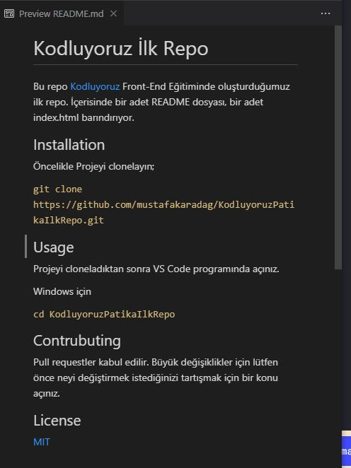

# Kodluyoruz İlk Repo

Bu repo [Kodluyoruz](https://www.kodluyoruz.org/) Front-End Eğitiminde oluşturduğumuz ilk repo. İçerisinde bir adet README dosyası, bir adet index.html barındırıyor.

## Installation

Öncelikle Projeyi clonelayın;

`git clone https://github.com/mustafakaradag/KodluyoruzPatikaIlkRepo.git`

## Usage

Projeyi cloneladıktan sonra VS Code programında açınız.

Windows için

`cd KodluyoruzPatikaIlkRepo`

## Contrubuting
Pull requestler kabul edilir. Büyük değişiklikler için lütfen önce neyi değiştirmek istediğinizi tartışmak için bir konu açınız.

## License

[MIT](https://choosealicense.com/licenses/mit/)

---

---

